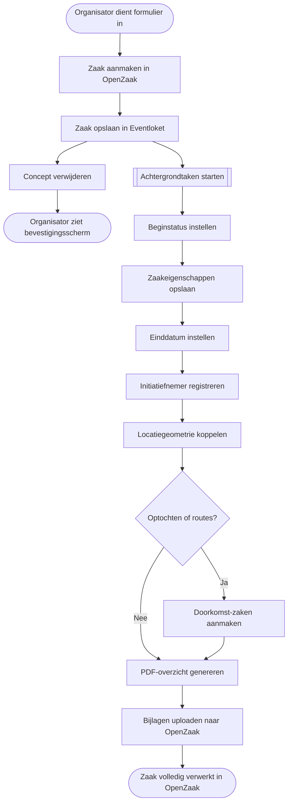
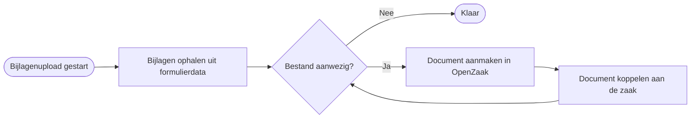

# Aanvraagformulier

Dit document beschrijft hoe het aanvraagformulier werkt voor evenementenorganisatoren en gemeentemedewerkers. Het formulier is onderdeel van Eventloket en vervangt het eerder gebruikte externe formulierensysteem Open Formulieren.

---

## Wat is het aanvraagformulier?

Het aanvraagformulier is de manier waarop organisatoren een evenementenanvraag indienen via Eventloket. Het formulier is nu volledig ingebouwd in Eventloket zelf. Organisatoren hoeven niet langer naar een externe website te gaan om een formulier in te vullen. Alles vindt plaats binnen het vertrouwde Eventloket-portaal.

Het formulier is een stapsgewijze wizard die de organisator begeleidt door alle relevante vragen. Op basis van de gegeven antwoorden bepaalt het formulier automatisch welke vragen wel en niet relevant zijn. Onnodige stappen worden overgeslagen.

---

## Wat vervangt het?

Het aanvraagformulier vervangt het formulier dat voorheen via Open Formulieren werd aangeboden. Open Formulieren was een extern systeem dat als ingesloten applicatie binnen Eventloket werd getoond. In de praktijk gaf dit regelmatig problemen:

- Het formulier laadde traag of moest lang nadenken bij wijzigingen.
- De controle op het formulier voor complexe logica en kaarten was beperkt, we liepen hier tegen een plafond aan.
- De look en feel van het formulier week af van de rest van Eventloket, wat verwarrend was voor gebruikers.
- Aanpassingen aan vragen of logica vereisten ingrepen in twee losse systemen tegelijk.

Met het nieuwe aanvraagformulier is dit alles geïntegreerd in Eventloket zelf. Er is geen extern systeem meer betrokken. Het formulier is stabieler, laadt sneller en voelt als één geheel met de rest van het portaal. Aanpassingen zijn eenvoudiger door te voeren en werken direct.

Daarnaast is de eerste gebruikersfeedback op de vragen verwerkt. Onduidelijke formuleringen zijn herschreven, de volgorde van een aantal stappen is verbeterd en drempelwaarden zijn beter afgestemd op de praktijk van de regiogemeenten.

---

## Hoe werkt het formulier voor organisatoren?

### Starten

Een organisator opent het formulier via het organisatorpaneel op `/organiser`. Het formulier is bereikbaar via de knop "Nieuwe aanvraag".

Als een organisator eerder al een aanvraag heeft ingediend, kan een vorige aanvraag als startpunt worden gebruikt via de prefill-functie. Gegevens als contactinformatie en organisatiegegevens worden dan alvast ingevuld.

### De stappen

Het formulier bestaat uit meerdere stappen die de organisator één voor één doorloopt. Niet elke stap is voor iedereen van toepassing; het formulier bepaalt op basis van de antwoorden welke stappen worden getoond.

| Stap | Omschrijving |
|------|--------------|
| Contactgegevens | Naam, e-mailadres en telefoonnummer van de contactpersoon. Deze gegevens worden automatisch ingevuld vanuit het account van de organisator. |
| Het evenement | Naam van het evenement en korte beschrijving. |
| Locatie | De locatie van het evenement, in te tekenen op een kaart. |
| Tijden | Begin- en eindtijden van het evenement, inclusief op- en afbouw. |
| Type aanvraag | De organisator geeft aan waarvoor het Eventloket wordt gebruikt: een evenementenvergunning aanvragen, een melding doen, of een vooraankondiging indienen. |
| Vergunningsplichtig scan | Een reeks ja/nee-vragen bepaalt of een melding voldoende is of dat een vergunning nodig is. De vragen zijn per gemeente ingesteld. |
| Melding (alleen bij melding) | Aanvullende informatie specifiek voor evenementen die als melding worden afgehandeld. |
| Risicoscan | Het formulier berekent automatisch een risiconiveau op basis van de ingevoerde gegevens. |
| Vergunningsaanvraag: soort | Het soort evenement en bijbehorende kenmerken. |
| Vergunningsaanvraag: kenmerken | Verdere details over het evenement, zoals bezoekersaantallen en het programma. |
| Vergunningsaanvraag: voorzieningen | Aanwezige voorzieningen zoals EHBO, beveiliging en sanitair. |
| Vergunningsaanvraag: voorwerpen | Tijdelijke objecten zoals tenten, podia en springkussens. |
| Vergunningsaanvraag: maatregelen | Geplande maatregelen op het gebied van veiligheid en openbare orde. |
| Vergunningsaanvraag: extra activiteiten | Bijzondere activiteiten zoals vuurwerk, alcohol of een optocht. |
| Vergunningsaanvraag: overig | Overige relevante informatie. |
| Bijlagen | De organisator uploadt eventuele bijlagen, zoals een veiligheidsplan of bebordingsplan. Bestanden mogen maximaal 30 MB groot zijn. |
| Samenvatting | Een overzicht van alle ingevulde gegevens. De organisator controleert de antwoorden en dient de aanvraag in. |

### Slim formulier

Het formulier past zich automatisch aan op basis van de gegeven antwoorden. Als een organisator bij de vergunningsplichtig scan aangeeft dat het om een klein evenement gaat waarvoor een melding volstaat, worden de uitgebreide vergunningsstappen niet getoond. Zo blijft het formulier zo beknopt mogelijk.

### Concept opslaan

Tussentijds wordt de voortgang automatisch als concept opgeslagen. De organisator kan het formulier sluiten en later verder invullen zonder gegevens te verliezen.

---

## Wat gebeurt er na het indienen?

Nadat een organisator het formulier indient, start een reeks automatische stappen op de achtergrond. De organisator ziet direct een bevestigingsscherm en kan de zaak volgen in het portaal.

### Direct na het indienen

1. De aanvraag wordt geregistreerd als zaak in Eventloket en in OpenZaak (het ZGW-zakenregister).
2. De aanvraag krijgt direct een zaaknummer en een beginstatus.
3. Een PDF-overzicht van de ingediende gegevens wordt aangemaakt. Dit overzicht is zichtbaar voor de behandelaar en de organisator.

Het PDF-overzicht is ten opzichte van Open Formulieren aanzienlijk verbeterd. Het bevat een gestructureerd overzicht van alle beantwoorde vragen, gegroepeerd per stap, met duidelijke koppen en een leesbare lay-out. Bijlagen worden apart vermeld met bestandsnaam.

### Op de achtergrond (automatisch)

Na de registratie worden automatisch een aantal aanvullende stappen uitgevoerd:

- Alle ingevulde gegevens worden als zaakeigenschappen opgeslagen in OpenZaak.
- De locatie van het evenement wordt als geometrie aan de zaak gekoppeld.
- Geüploade bijlagen worden overgebracht naar OpenZaak en aan de zaak gekoppeld.
- De initiatiefnemer (de organisator) wordt als betrokkene geregistreerd.
- Eventuele doorkomsten (routes bij optochten of marsen) krijgen een eigen gekoppelde zaak.

Deze stappen vinden asynchroon plaats en zijn doorgaans binnen een paar seconden klaar.

### Overzicht van de verwerkingsstroom

Het diagram hieronder toont wat er achter de schermen gebeurt nadat een organisator het formulier indient.

Het diagram hieronder laat zien hoe bijlagen specifiek worden verwerkt.

### Zaaktype per gemeente

Voor elke gemeente is in OpenZaak een zaaktype geconfigureerd dat bepaalt hoe een aanvraag wordt verwerkt. Afhankelijk van het type aanvraag (evenementenvergunning, melding of vooraankondiging) wordt het bijpassende zaaktype automatisch geselecteerd. Gemeentebeheerders en platformbeheerders kunnen zaaktypes blijven instellen en aanpassen via het beheerpaneel, net als voorheen.

### Zichtbaarheid in het gemeentepaneel

Zodra de zaak is aangemaakt, is de aanvraag zichtbaar voor behandelaars in het gemeentepaneel. Zij kunnen de zaak openen, de ingediende gegevens inzien, bijlagen downloaden en de status bijwerken.

---

## Drie uitkomsten

Na het doorlopen van het formulier resulteert elke aanvraag in één van de volgende zaaktypes:

| Uitkomst | Wanneer |
|----------|---------|
| **Evenementenvergunning** | Het evenement vereist een officiële vergunning op basis van de beantwoorde vragen. |
| **Melding** | Het evenement is klein genoeg om met een melding af te worden gedaan. |
| **Vooraankondiging** | De organisator geeft vroegtijdig aan een evenement te willen organiseren, zonder directe vergunningsaanvraag. |

Het formulier bepaalt dit op basis van de vragen en de per gemeente ingestelde drempelwaarden.

---

## Voor gemeentemedewerkers

### Zaaktypes instellen

Gemeentemedewerkers en platformbeheerders kunnen zaaktypes per gemeente instellen en koppelen via het beheerpaneel. Het nieuwe formulier werkt met dezelfde zaaktypes als voorheen. Er is geen wijziging nodig in de OpenZaak-configuratie vanwege het nieuwe formulier.

### Gemeentevariabelen

Een aantal vragen in het formulier is afhankelijk van per gemeente ingestelde waarden, zoals drempelwaarden voor bezoekersaantallen, toegestane tijdvensters en geluidsnormen. Deze waarden worden beheerd via de gemeente-instellingen in het beheerpaneel en zijn direct van invloed op de vragen die een organisator te zien krijgt.

### Meldingvragen

De ja/nee-vragen in de vergunningsplichtig scan zijn per gemeente instelbaar. Gemeentebeheerders kunnen de vraagteksten aanpassen, vragen activeren of deactiveren, en de volgorde aanpassen. Zie de documentatie [Meldingvragen](meldingvragen.md) voor meer informatie.

### Data in OpenZaak

Alle ingediende aanvragen worden opgeslagen in OpenZaak via de ZGW API. Dit betekent dat de zaakdata beschikbaar blijft via de vertrouwde ZGW-standaard, ongeacht of de aanvraag via het nieuwe formulier of een eerder formulier is ingediend. Gemeenten die OpenZaak gebruiken voor rapportage of koppeling met andere systemen hoeven hiervoor niets aan te passen.
