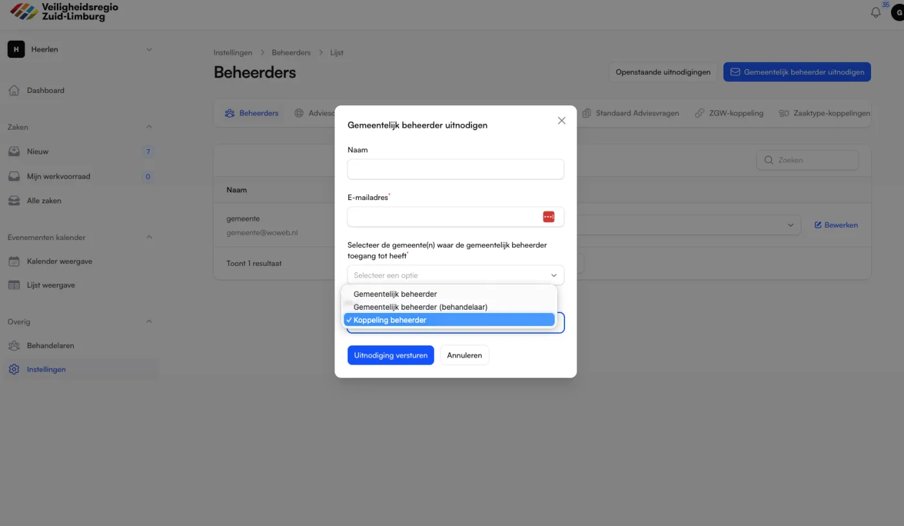
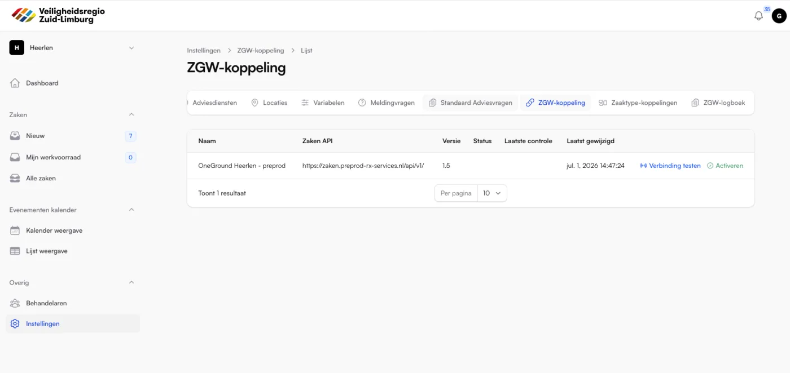
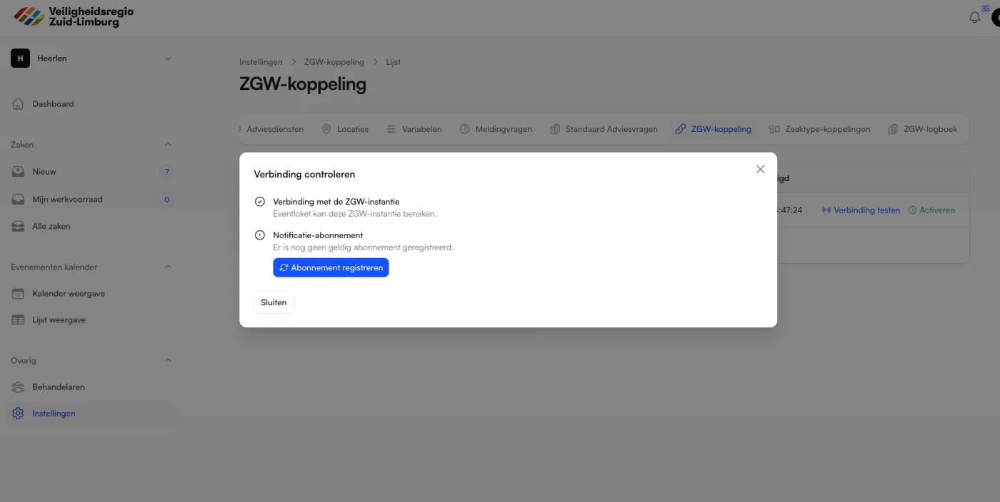
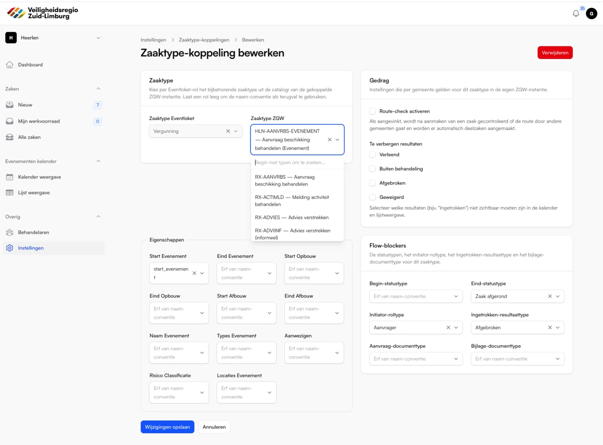
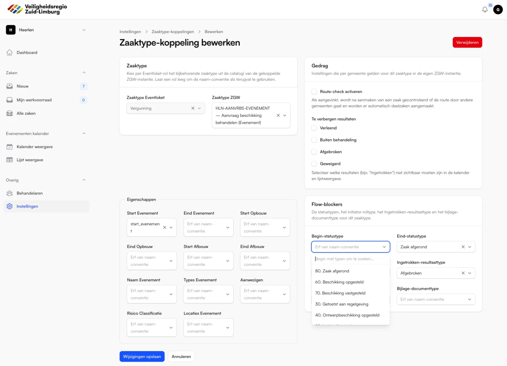
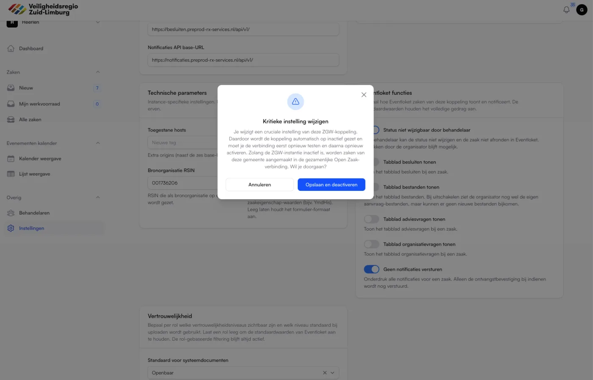
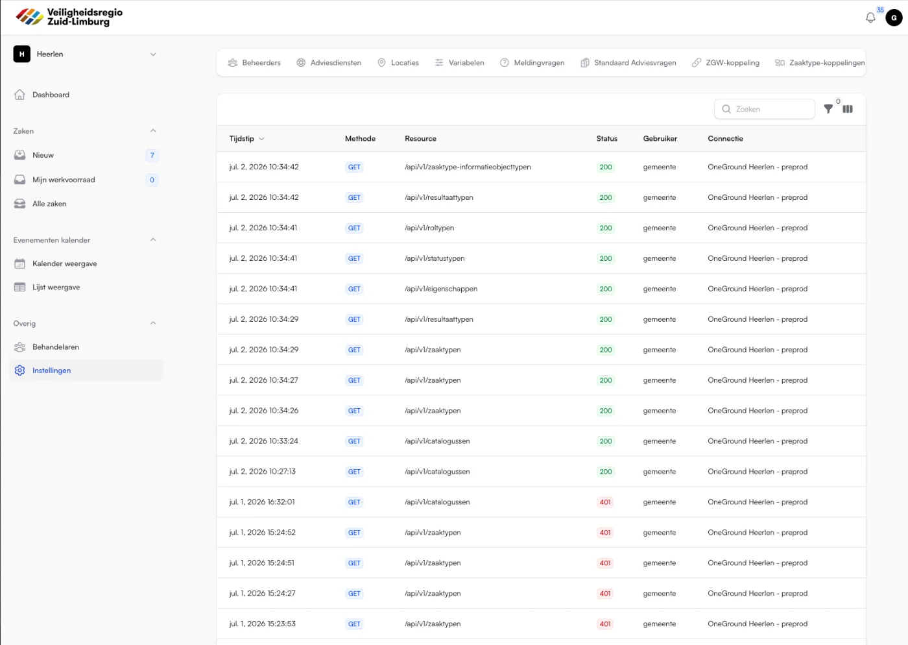

# ZGW-koppelingbeheer

Dit document beschrijft hoe een functioneel beheerder een ZGW-koppeling voor een gemeente opzet en onderhoudt in Eventloket. Het legt uit hoe de beheeromgeving werkt en geeft een volledig stappenplan, inclusief wat er aan de externe zaaksysteem-applicatie (bijvoorbeeld Open Zaak of OneGround) klaargezet moet worden.

Dit document is geschreven voor functioneel beheerders. Er is geen technische ontwikkelkennis nodig, maar wel toegang tot beheer van het zaaksysteem van de betreffende gemeente (of contact met de leverancier daarvan).

---

## 1. Achtergrond en begrippen

### Wat is een ZGW-koppeling?

Eventloket maakt van elke ingediende evenementenaanvraag een zaak aan in een zaaksysteem dat de ZGW-API-standaarden ondersteunt. ZGW staat voor "Zaakgericht Werken" en is de Nederlandse standaard waarmee gemeenten hun zaken, documenten, besluiten en notificaties uitwisselen. Bekende implementaties zijn Open Zaak en OneGround van Rx.Mission.

Standaard schrijven alle gemeenten naar één gedeelde zaaksysteem-verbinding, in dit document de **hoofdkoppeling** genoemd (intern heet deze `main`). Dit is de gezamenlijke Open Zaak van de veiligheidsregio.

Een gemeente kan er echter voor kiezen om haar eigen zaaksysteem te gebruiken. Daarvoor richt de beheerder een **eigen ZGW-koppeling** in voor die gemeente. Vanaf het moment dat die koppeling actief is, worden alle zaken van die gemeente naar haar eigen zaaksysteem geschreven in plaats van naar de hoofdkoppeling.

### Erven van de hoofdkoppeling

Een eigen koppeling hoeft niet volledig ingevuld te worden. Elk veld dat leeg blijft, erft automatisch de waarde van de hoofdkoppeling. Zo kan een gemeente bijvoorbeeld alleen andere inloggegevens en een andere zaken-URL opgeven en de rest van het gedrag identiek aan de hoofdkoppeling houden.

### Levenscyclus van een koppeling

Een koppeling doorloopt drie toestanden:

1. **Aangemaakt maar niet getest.** De koppeling bestaat, maar Eventloket heeft nog niet gecontroleerd of de gegevens kloppen.
2. **Getest.** De verbinding is met succes gecontroleerd. Pas dan kan de koppeling geactiveerd worden.
3. **Actief.** De koppeling verwerkt daadwerkelijk de zaken van de gemeente. Zolang een koppeling niet actief is, blijft de gemeente op de hoofdkoppeling draaien.

Belangrijk: het wijzigen van een cruciale instelling (een endpoint, inloggegeven of de versie) zet een actieve koppeling automatisch terug op inactief. De verbinding moet dan opnieuw getest en opnieuw geactiveerd worden. Dit voorkomt dat een verkeerde wijziging stil doorwerkt op productiezaken. Zie [sectie 8](#8-onderhoud-en-wijzigingen).

---

## 2. Wie mag koppelingen beheren?

Toegang tot het koppelingbeheer is voorbehouden aan twee rollen:

| Rol | Kan koppelingen beheren | Kan zaken behandelen |
|-----|-------------------------|----------------------|
| Gemeentebeheerder (MunicipalityAdmin) | Ja | Ja |
| Koppelingbeheerder (KoppelingBeheerder) | Ja | Nee (alleen inzien) |

De rol **Koppelingbeheerder** is speciaal bedoeld voor functioneel of technisch beheer. Iemand met deze rol beheert de ZGW-instellingen en kan zaken inzien, maar kan zaken niet inhoudelijk behandelen. Dit is de aangewezen rol voor een leverancier of applicatiebeheerder die alleen de techniek moet inrichten.

### Een koppelingbeheerder uitnodigen

1. Ga naar het gemeentepaneel op `/municipality`.
2. Open het onderdeel waar gemeentegebruikers worden beheerd (de beheerders-tab binnen Instellingen).
3. Kies "Uitnodigen".
4. Vul naam en e-mailadres in, kies de betreffende gemeente(n) en selecteer bij **Rol** de optie "Koppelingbeheerder".
5. Verstuur de uitnodiging. De genodigde ontvangt een e-mail met een link om een account aan te maken.

---

## 3. Waar vind je het koppelingbeheer?

Alle beheerschermen zitten in het gemeentepaneel onder het menu **Instellingen** (in de navigatiegroep "Overig"). Binnen Instellingen staan de volgende onderdelen die met de ZGW-koppeling te maken hebben:

| Menu-onderdeel | Doel |
|----------------|------|
| ZGW-koppeling | De technische verbinding: endpoints, inloggegevens, functies en vertrouwelijkheid. |
| Zaaktype-koppelingen | Het koppelen van Eventloket-rollen aan zaaktypen uit het externe zaaksysteem, plus eigenschappen en flow-instellingen. |
| ZGW-logboek | Een read-only overzicht van alle verkeer tussen Eventloket en het zaaksysteem, voor diagnose. |

Elke gemeente ziet alleen haar eigen koppeling en haar eigen gegevens. Er kan per gemeente maximaal één ZGW-koppeling bestaan.

---

## 4. Voorbereiding aan de kant van het zaaksysteem

Voordat je in Eventloket iets invult, moet het externe zaaksysteem van de gemeente klaargezet worden. Zonder deze voorbereiding zal de verbindingstest mislukken. Deze stappen voer je uit in het zaaksysteem zelf, of je laat ze uitvoeren door de leverancier van dat systeem.

### 4.1 Zorg dat de ZGW-API's beschikbaar zijn

Eventloket praat met vijf tot zes losse ZGW-API-componenten. Zorg dat de volgende componenten actief en bereikbaar zijn en noteer per component de volledige base-URL, inclusief het versiepad en een afsluitende slash:

| Component | Voorbeeld base-URL | Verplicht |
|-----------|--------------------|-----------|
| Zaken API | `https://zaaksysteem.gemeente.nl/zaken/api/v1/` | Ja |
| Catalogi API | `https://zaaksysteem.gemeente.nl/catalogi/api/v1/` | Ja |
| Documenten API | `https://zaaksysteem.gemeente.nl/documenten/api/v1/` | Ja |
| Besluiten API | `https://zaaksysteem.gemeente.nl/besluiten/api/v1/` | Ja |
| Notificaties API | `https://notificaties.gemeente.nl/api/v1/` | Aanbevolen (nodig voor statusupdates) |

De Autorisaties API wordt niet apart in Eventloket ingevuld omdat die op dit moment niet gebruikt wordt.

**Let op de afsluitende slash aan het einde van elke URL. Deze is verplicht.**

### 4.2 Maak een API-client (inloggegevens) aan

Eventloket authenticeert zich met een client-ID en een client-secret (dit is de manier waarop ZGW-systemen JWT-tokens ondertekenen). Maak in het zaaksysteem een API-toepassing aan en noteer:

- **Client ID**
- **Client secret.** Dit secret moet minimaal 32 tekens lang zijn. Kortere secrets worden door Eventloket geweigerd omdat de onderliggende beveiliging (HS256-ondertekening) een sleutel van minstens 32 bytes vereist. Als het zaaksysteem een korter secret genereert, genereer dan een langere.

### 4.3 Ken de juiste autorisaties (scopes) toe

De aangemaakte API-client moet voldoende rechten (autorisaties/scopes) hebben op de betreffende zaaktypen om zaken te kunnen aanmaken, bijwerken, lezen, documenten toe te voegen, besluiten vast te leggen en notificaties te ontvangen. Ken minimaal toe:

- Aanmaken, lezen en bijwerken van zaken.
- Lezen van de catalogi (zaaktypen, statustypen, roltypen, resultaattypen, eigenschappen, informatieobjecttypen).
- Aanmaken, lezen en bijwerken van documenten.
- Aanmaken en lezen van besluiten.
- Rechten om notificatie-abonnementen te registreren en te ontvangen.

Zonder de juiste autorisaties lukt de verbinding technisch wel, maar mislukt het aanmaken van een zaak later alsnog. Test daarom altijd ook met een echte proefaanvraag (zie [sectie 7](#7-eindcontrole-met-een-proefaanvraag)).

### 4.4 Richt de zaaktypecatalogus in

Eventloket verwacht dat er in de catalogi zaaktypen bestaan voor de verschillende soorten aanvragen. Standaard zijn dat er vier:

| Eventloket-rol | Bedoeld voor |
|----------------|--------------|
| Vergunning | Een reguliere evenementenvergunning. |
| Melding | Een meldingsplichtig (klein) evenement. |
| Vooraankondiging | Een vooraankondiging van een evenement. |
| Doorkomst | Een doorkomst van een route (optocht of wedstrijd) door de gemeente. |

Zorg dat elk zaaktype dat de gemeente wil gebruiken bestaat en gepubliceerd is, en dat het beschikt over:

- De **eigenschappen** die bij een evenement horen (start- en einddatums, naam evenement, soort evenement, aantal aanwezigen, risicoclassificatie, locaties). In de gedeelde hoofdkoppeling heten deze eigenschappen exact zoals de logische sleutels in Eventloket. In een eigen zaaksysteem mogen ze anders heten; die vertaling leg je later vast in de zaaktype-koppeling (zie [sectie 6](#6-zaaktype-koppelingen-instellen)).
- De **statustypen** die de zaak doorloopt, met minimaal een begin-status en een eindstatus.
- Een **roltype** voor de initiator (de organisator/aanvrager).
- De **resultaattypen**, waaronder een resultaattype voor "Ingetrokken".
- De **informatieobjecttypen** (documenttypen) voor de aanvraag-PDF en voor bijlagen.

### 4.5 Bereid notificaties voor

Als de gemeente wil dat statuswijzigingen vanuit het zaaksysteem terugkomen in Eventloket (bijvoorbeeld wanneer een behandelaar in het zaaksysteem iets wijzigt), moet de Notificaties API beschikbaar zijn. Eventloket registreert zelf automatisch een abonnement op deze API tijdens de verbindingstest. Zorg alleen dat:

- De Notificaties API bereikbaar is vanaf Eventloket.
- De API-client rechten heeft om een abonnement te registreren.
- De callback-URL van Eventloket bereikbaar is vanaf het zaaksysteem. Eventloket vult deze callback zelf in bij het registreren van het abonnement.

Als er geen Notificaties API wordt ingevuld, blijft de rest van de koppeling gewoon werken; alleen automatische statusupdates vanuit het zaaksysteem ontbreken dan.

---

## 5. De koppeling aanmaken in Eventloket

Nu de gegevens uit sectie 4 verzameld zijn, kan de koppeling in Eventloket worden ingevoerd.

1. Ga naar het gemeentepaneel op `/municipality`, open **Instellingen** en klik op **ZGW-koppeling**.
2. Klik op de knop om een nieuwe koppeling aan te maken. Deze knop is alleen zichtbaar als er nog geen koppeling voor de gemeente bestaat.

Het formulier is opgedeeld in secties. Hieronder wordt elke sectie en elk veld toegelicht.

### 5.1 Naam

Een optioneel, vrij in te vullen label ter herkenning (bijvoorbeeld "Rx.Mission gemeente X"). Dit heeft geen invloed op de werking; het maakt de koppeling alleen makkelijker terug te vinden in overzichten en in het logboek.

### 5.2 Endpoints

Vul hier de base-URL's in die je in [sectie 4.1](#41-zorg-dat-de-zgw-apis-beschikbaar-zijn) hebt genoteerd:

- Zaken API base-URL
- Catalogi API base-URL
- Documenten API base-URL
- Besluiten API base-URL
- Notificaties API base-URL

### 5.3 Authenticatie

- **ZGW-versie.** Kies de ZGW-standaardversie die het zaaksysteem ondersteunt. Bij twijfel: overleg met de leverancier.
- **Client ID.** Het client-ID uit [sectie 4.2](#42-maak-een-api-client-inloggegevens-aan).
- **Client secret.** Het secret uit sectie 4.2 (minimaal 32 tekens). Bij het aanmaken is dit veld verplicht. Bij een latere bewerking kun je het leeg laten om het bestaande secret ongewijzigd te houden; het opgeslagen secret wordt om veiligheidsredenen nooit teruggetoond in het formulier.
- **User ID** en **User representation.** Optionele velden die het zaaksysteem gebruikt om vast te leggen namens wie Eventloket handelt. Laat leeg om de standaard van de hoofdkoppeling te erven.

### 5.4 Technische parameters

- **Toegestane hosts.** Extra origins (naast de vijf base-URL's) waarvandaan deze koppeling documenten mag ophalen. Meestal leeg te laten.
- **Bronorganisatie RSIN.** Het RSIN dat als bronorganisatie op elke zaak wordt gezet. Vul het RSIN van de gemeente in als het zaaksysteem dit vereist; laat leeg om de waarde van de hoofdkoppeling te erven (RSIN van de veiligheidsregio).
- **Datumformaat zaakeigenschappen.** Optioneel PHP-datumformaat voor datumwaarden in zaakeigenschappen (bijvoorbeeld `YmdHis`). Sommige zaaksystemen, zoals Rx.Mission, verwachten datums in een specifiek formaat. Laat leeg om het standaardformaat aan te houden. Vraag dit bij twijfel na bij de leverancier.

### 5.5 Eventloket-functies

In deze sectie bepaal je hoe Eventloket zaken van deze koppeling toont en notificeert. De standaardwaarden houden het volledige gedrag aan; pas ze alleen aan als de werkwijze van de gemeente daarom vraagt.

- **Status niet wijzigbaar door behandelaar.** Als dit aan staat, kan de behandelaar de status van een zaak niet vanuit Eventloket wijzigen en de zaak niet afronden. De status wordt dan volledig in het zaaksysteem beheerd. Intrekken door de organisator blijft mogelijk.
- **Tabblad besluiten tonen.** Toont het tabblad Besluiten bij een zaak.
- **Tabblad bestanden tonen.** Toont het tabblad Bestanden. Bij uitschakelen ziet de organisator nog wel de eigen aanvraag-bestanden, maar kunnen er geen nieuwe bestanden bijkomen.
- **Tabblad adviesvragen tonen.** Toont het tabblad Adviesvragen bij een zaak.
- **Tabblad organisatievragen tonen.** Toont het tabblad Organisatievragen bij een zaak.
- **Geen notificaties versturen.** Onderdrukt alle notificaties voor zaken van deze koppeling. Alleen de ontvangstbevestiging bij het indienen wordt dan nog verstuurd.

### 5.6 Vertrouwelijkheid

Hier bepaal je per rolgroep welke vertrouwelijkheidsniveaus zichtbaar zijn en welk niveau standaard wordt gebruikt bij het uploaden van een document. De rolgroepen zijn Organisator, Adviseur en Gemeente (behandelaars en beheerders).

- **Zichtbare niveaus.** De vertrouwelijkheidsniveaus die deze rolgroep mag zien.
- **Standaard bij uploaden.** Het niveau dat vooraf is ingevuld wanneer iemand uit deze rolgroep een document uploadt.
- **Standaard voor systeemdocumenten.** Het niveau voor automatisch gegenereerde documenten, namelijk de aanvraag-PDF en de formulier-bijlagen.

Laat een veld leeg om de standaardwaarden van Eventloket aan te houden. De rol-gebaseerde filtering blijft altijd actief, ongeacht deze instellingen. Als alle drie de document-tabbladen zijn uitgeschakeld, verdwijnen de per-rol velden vanzelf, omdat er dan toch niet geüpload kan worden. De standaard voor systeemdocumenten blijft dan wel relevant.

3. Sla het formulier op. De koppeling is nu aangemaakt, maar nog **niet actief**. De gemeente draait dus nog steeds op de hoofdkoppeling totdat de koppeling is getest en geactiveerd.

---

## 6. De verbinding testen en activeren

Een nieuwe of gewijzigde koppeling moet eerst getest worden voordat je hem kunt activeren. Dit gebeurt vanuit de lijstweergave ZGW-koppeling.

### 6.1 Verbinding testen

1. Klik in de lijstweergave bij de koppeling op de actie **Verbinding testen**.
2. Er opent een venster dat automatisch twee controles uitvoert:
   - **Verbinding met de ZGW-instantie.** Controleert of Eventloket het zaaksysteem kan bereiken met de opgegeven endpoints en inloggegevens.
   - **Notificatie-abonnement.** Controleert of er een geldig notificatie-abonnement bestaat. Als dat er nog niet is, verschijnt de knop **Abonnement registreren** waarmee je het abonnement direct aanmaakt. Heeft de koppeling geen Notificaties API-URL, dan meldt de stap dat er geen abonnement mogelijk is.

3. Als beide stappen slagen, wordt de datum en tijd van de geslaagde controle vastgelegd bij de koppeling ("Laatste controle"). Sluit het venster.

Als een stap mislukt, toont het venster een algemene foutmelding. De precieze technische oorzaak wordt niet aan de gebruiker getoond, maar wel intern gelogd. Controleer in dat geval de endpoints, de inloggegevens en de autorisaties in het zaaksysteem, en raadpleeg zonodig het ZGW-logboek (zie [sectie 9](#9-het-zgw-logboek)).

### 6.2 Activeren

1. Zodra de verbinding met succes is getest, verschijnt bij de koppeling de actie **Activeren**. Deze actie is uitgeschakeld zolang er nog geen geslaagde controle is; de tooltip legt dan uit dat je eerst de verbinding moet testen.
2. Klik op **Activeren** en bevestig in het venster. Vanaf dat moment worden alle nieuwe zaken van deze gemeente via haar eigen zaaksysteem verwerkt. **Let op dat je een koppeling pas activeert nadat je de zaaktyp-koppelingen hebt ingesteld.**

De status van de koppeling in de lijst verspringt naar **Actief** (groen).

### 6.3 Deactiveren

Wil je de gemeente tijdelijk terugzetten op de hoofdkoppeling, klik dan op **Deactiveren** en bevestig. De koppeling blijft bewaard, maar zaken van de gemeente vallen terug op de gedeelde hoofdkoppeling tot je de koppeling opnieuw activeert.

---

## 7. Zaaktype-koppelingen instellen

De ZGW-koppeling uit de vorige secties regelt de verbinding. Daarnaast moet Eventloket weten welk zaaktype uit het externe zaaksysteem bij welke Eventloket-rol hoort, en hoe de velden van een aanvraag zich verhouden tot de eigenschappen in dat zaaktype. Dat leg je vast onder **Instellingen, Zaaktype-koppelingen**.

Zonder zaaktype-koppeling valt Eventloket terug op de naam-conventie (zie de prefixen in [sectie 4.4](#44-richt-de-zaaktypecatalogus-in)). Werkt het externe zaaksysteem met afwijkende namen, dan is een expliciete koppeling noodzakelijk. Een extern zaaksysteem werkt vrijwel altijd met afwijkende namen dus stel altijd de zaaktype-koppelingen in om er zeker van te zijn dat de zaken goed worden aangemaakt.

De keuzelijsten in dit scherm worden live geladen uit de catalogi van de eigen ZGW-koppeling van de gemeente. Ze werken al voordat de koppeling geactiveerd is, zodat je alles vooraf kunt inrichten. De koppeling moet dus wel aangemaakt en getest zijn, zodat de catalogi bereikbaar zijn.

Maak per gebruikte type in Eventloket (Vergunning, vooraankondiging, melding en doorkomstgemeente) een koppeling aan:

1. Klik op de knop om een nieuwe zaaktype-koppeling aan te maken.
2. Vul de sectie **Zaaktype** in:
   - **Zaaktype Eventloket.** Kies de rol (Vergunning, Melding, Vooraankondiging of Doorkomst). Elke rol kan per gemeente maar één keer gekoppeld worden. Deze keuze kan na aanmaken niet meer gewijzigd worden.
   - **Zaaktype ZGW.** Kies het bijbehorende zaaktype uit de catalogi van het externe zaaksysteem.

3. Vul de sectie **Eigenschappen** in. Voor elke logische Eventloket-sleutel (bijvoorbeeld "start evenement", "naam evenement", "aanwezigen") kies je de bijbehorende eigenschap-naam in het gekozen zaaktype. Laat een sleutel leeg als het zaaktype die eigenschap niet kent; die wordt dan overgeslagen. Voor de gedeelde hoofdkoppeling zijn de namen identiek en is invullen niet nodig.
4. Vul de sectie **Flow-blockers** in. Dit zijn de sleutelpunten in de zaakflow:
   - **Begin-statustype.** De status die de zaak krijgt bij aanmaken.
   - **Eind-statustype.** De status die de zaak krijgt bij afronden (Ook wanneer een organisator een aanvraag intrekt).
   - **Initiator-roltype.** Het roltype waaronder de aanvrager als initiator wordt vastgelegd.
   - **Ingetrokken-resultaattype.** Het resultaattype dat wordt gezet als een aanvraag wordt ingetrokken.
   - **Aanvraag-documenttype.** Het informatieobjecttype voor de aanvraag-PDF.
   - **Bijlage-documenttype.** Het informatieobjecttype voor de bijlagen bij de aanvraag.

   Laat een veld leeg om terug te vallen op de standaard-heuristiek (Eventloket kiest dan zelf een passend type op basis van naam).

5. De sectie **Gedrag** verschijnt alleen bij een gemeente met een eigen ZGW-koppeling en een gekozen zaaktype. Hierin regel je:
   - **Route-check activeren.** Als aangevinkt, controleert Eventloket na het aanmaken van een zaak of de route door andere gemeenten loopt en maakt het automatisch deelzaken aan. Zet dit aan bij het Doorkomst-zaaktype.
   - **Te verbergen resultaten.** Selecteer welke resultaattypen (bijvoorbeeld "Ingetrokken") niet zichtbaar moeten zijn in de kalender en de lijstweergave.

6. Sla de koppeling op. Herhaal dit voor elke rol die de gemeente gebruikt.

---

## 8. Eindcontrole met een proefaanvraag

Een geslaagde verbindingstest bewijst dat Eventloket het zaaksysteem kan bereiken, maar niet dat alle autorisaties en zaaktype-instellingen kloppen. Voer daarom altijd een echte proef uit:

1. Dien via het organisatorpaneel een testaanvraag in voor de betreffende gemeente.
2. Controleer in het externe zaaksysteem dat:
   - De zaak is aangemaakt onder het juiste zaaktype.
   - De zaakeigenschappen correct gevuld zijn.
   - De initiator (aanvrager) is vastgelegd.
   - De aanvraag-PDF en eventuele bijlagen als documenten zijn toegevoegd.
   - De beginstatus correct is gezet.
3. Controleer in Eventloket dat de zaak zichtbaar is in het gemeentepaneel en dat de status klopt.
4. Test zonodig een statuswijziging in het zaaksysteem en controleer of die via notificaties terugkomt in Eventloket.

Pas als deze proef slaagt is de koppeling volledig bruikbaar.

---

## 9. Onderhoud en wijzigingen

### Cruciale wijzigingen zetten de koppeling offline

Het wijzigen van een van de volgende velden wordt als cruciaal beschouwd: de endpoints, de ZGW-versie, het client-ID, het client-secret, het User ID, de User representation, het bronorganisatie-RSIN en de toegestane hosts.

Als je zo'n veld wijzigt en opslaat, verschijnt een bevestigingsvenster dat waarschuwt dat de koppeling automatisch op inactief wordt gezet. Bevestig je, dan wordt de koppeling gedeactiveerd en valt de gemeente terug op de gedeelde hoofdkoppeling totdat je de verbinding opnieuw hebt getest en geactiveerd.

De juiste volgorde bij een cruciale wijziging is dus altijd:

1. Wijzig het veld en sla op (bevestig de deactivering).
2. Test de verbinding opnieuw.
3. Activeer de koppeling opnieuw.

Niet-cruciale wijzigingen (naam, functie-schakelaars, vertrouwelijkheid) hoeven niet opnieuw getest te worden en laten een actieve koppeling actief.

### Alle wijzigingen worden vastgelegd

Elke wijziging aan een koppeling wordt geregistreerd in de activiteitenlog: wie welk veld heeft aangepast en van welke naar welke waarde. Het client-secret wordt daarbij nooit als leesbare waarde vastgelegd.

---

## 10. Het ZGW-logboek

Onder **Instellingen, ZGW-logboek** staat een read-only overzicht van al het verkeer tussen Eventloket en het zaaksysteem van de gemeente. Dit is het eerste hulpmiddel bij het onderzoeken van problemen.

Per regel zie je:

- Het tijdstip van de aanroep.
- De methode (GET, POST, PUT, PATCH, DELETE of NOTIFY).
- De aangeroepen resource (het pad, zonder gevoelige querygegevens).
- De statuscode (groen bij succes, rood bij een fout).
- De gebruiker die de aanroep veroorzaakte, indien bekend.
- De koppeling waarop de aanroep plaatsvond.

Je kunt filteren op mislukte aanroepen en op methode, en zoeken op resource of gebruiker. Het logboek bevat alleen metadata, geen berichtinhoud. Oude regels worden automatisch opgeschoond volgens de ingestelde bewaartermijn (standaard 90 dagen).

---

## 11. Beknopte checklist

Gebruik deze checklist als samenvatting bij het opzetten van een nieuwe gemeente-koppeling.

**In het zaaksysteem:**

- [ ] De vijf tot zes ZGW-API-componenten zijn actief; de base-URL's zijn genoteerd (met versiepad en afsluitende slash).
- [ ] Er is een API-client aangemaakt; client-ID en een client-secret van minimaal 32 tekens zijn genoteerd.
- [ ] De client heeft autorisaties voor zaken, catalogi, documenten, besluiten en notificaties.
- [ ] De zaaktypen bestaan en zijn gepubliceerd, met de juiste eigenschappen, statustypen, roltypen, resultaattypen en documenttypen.
- [ ] De Notificaties API is bereikbaar (indien statusupdates gewenst zijn).

**In Eventloket:**

- [ ] (Optioneel) Een koppelingbeheerder is uitgenodigd.
- [ ] De ZGW-koppeling is aangemaakt met endpoints, inloggegevens, functies en vertrouwelijkheid.
- [ ] De verbinding is getest en, indien nodig, het notificatie-abonnement is geregistreerd.
- [ ] De zaaktype-koppelingen zijn ingesteld per rol (zaaktype, eigenschappen, flow-blockers, gedrag).
- [ ] De koppeling is geactiveerd.
- [ ] Een proefaanvraag is met succes doorgekomen in het zaaksysteem.
</content>
</invoke>
